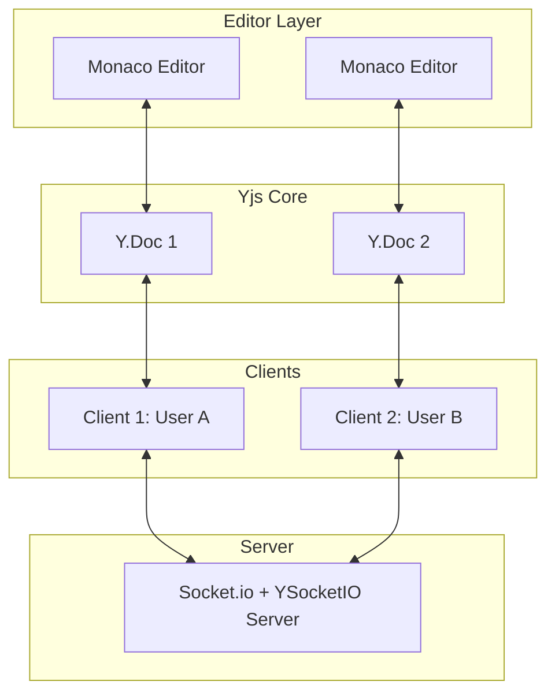
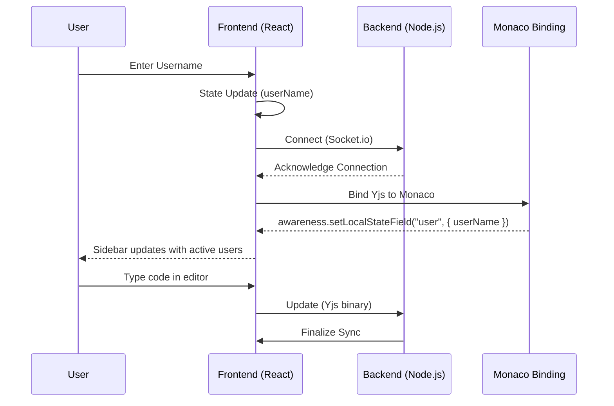

# Nexora - Collaborative Code Editor

Nexora is a high-performance, real-time collaborative code editor that allows multiple developers to code together in a conflict-free environment. Built with **React 19**, **Monaco Editor**, and **Yjs**, it provides a seamless "Google Docs-style" experience for distributed development teams.

## 🚀 Key Features

- **Real-time Collaboration**: Powered by Yjs CRDT for smooth, conflict-free editing.
- **Monaco Editor Integration**: Full-featured code editor with syntax highlighting and intelligent code features.
- **User Presence Tracking**: Sidebar with active users and cursor awareness.
- **Room-based Editing**: Automatic room creation based on URL parameters.
- **Modern UI**: Sleek, responsive design built with Tailwind CSS 4.

---

## 🛠 Tech Stack

### Frontend
- **React 19**: Core UI framework for the application.
- **Vite 7**: Ultra-fast build tool and development server.
- **Monaco Editor**: The powerful editor engine behind VS Code.
- **Yjs**: Shared editing framework using Conflict-Free Replicated Data Types (CRDT).
- **y-socket.io**: WebSocket-based provider for Yjs over Socket.io.
- **Tailwind CSS 4**: Modern styling with zero runtime cost.

### Backend
- **Node.js**: Asynchronous JavaScript runtime.
- **Express**: Minimalist web framework for Node.js.
- **Socket.io**: Real-time, bidirectional, event-based communication.
- **y-socket.io server**: Centralized Yjs document synchronization server.

---

## 🏗 Architecture

Nexora follows a distributed architecture where the state is maintained through CRDTs, ensuring eventual consistency across all clients without a complex central authority.



### Data Flow
1. **Local Edit**: A user types in the Monaco Editor.
2. **Binding**: The change is instantly captured by `MonacoBinding` and applied to the local `Y.Doc`.
3. **Synchronize**: The `SocketIOProvider` detects the change in the local `Y.Doc` and broadcasts the update to the server.
4. **Broadcast**: The server receives the update and forwards it to all other connected clients in the same room.
5. **Merge**: Peer clients receive the update and automatically merge it into their local `Y.Doc`, which reflects in their Monaco instances.

---

## 🔄 Interaction Flow



---

## 🛠 Setup & Installation

### Prerequisites
- [Node.js](https://nodejs.org/) (Recommended: Latest LTS)
- [npm](https://www.npmjs.com/)

### 1. Clone the repository
```bash
git clone https://github.com/SRB77/Nexora.git
cd Nexora
```

### 2. Backend Setup
```bash
cd Backend
npm install
npm run dev
```
The server will start on `http://localhost:3000`.

### 3. Frontend Setup
```bash
cd ../Frontend
npm install
npm run dev
```
The application will start on `http://localhost:5173`. Open your browser and navigate to `http://localhost:5173`.

---

## 📄 License
This project is licensed under the **ISC License**.

---

